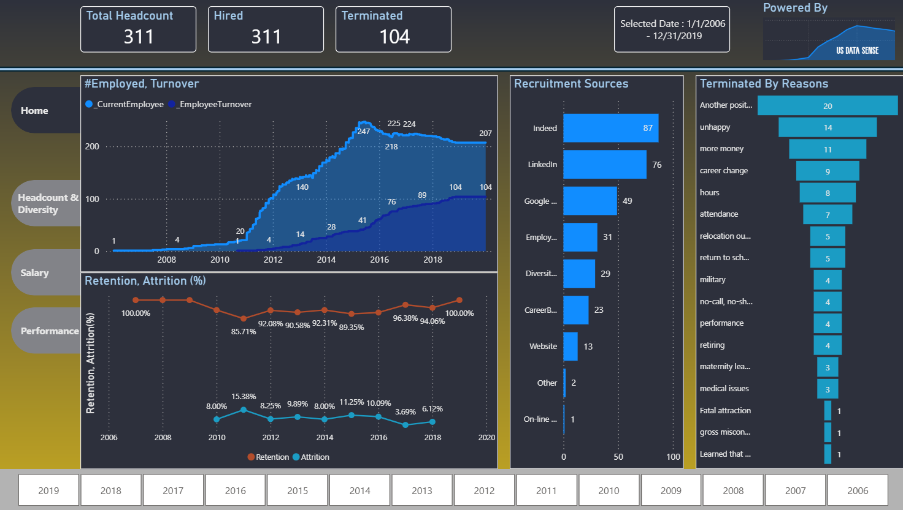
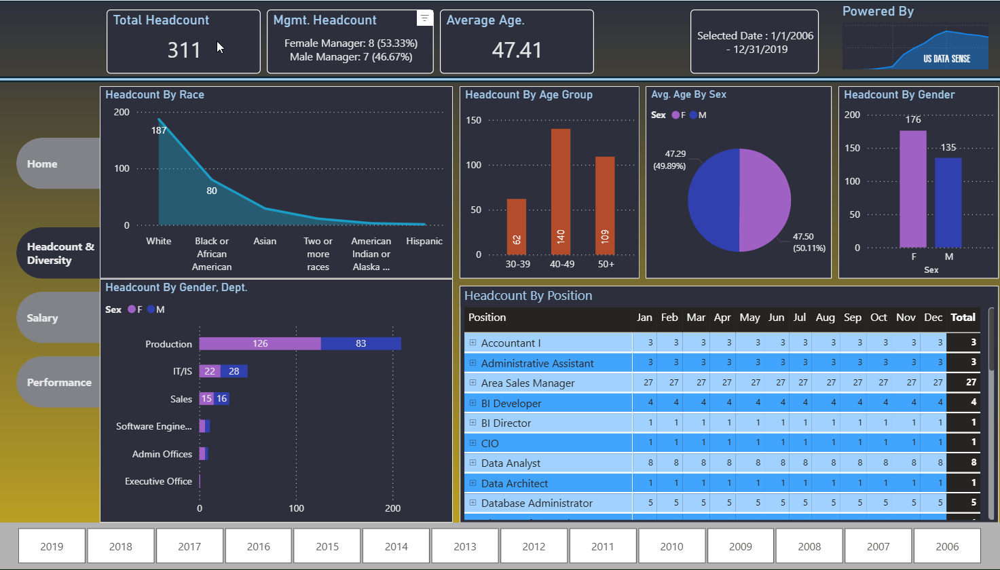
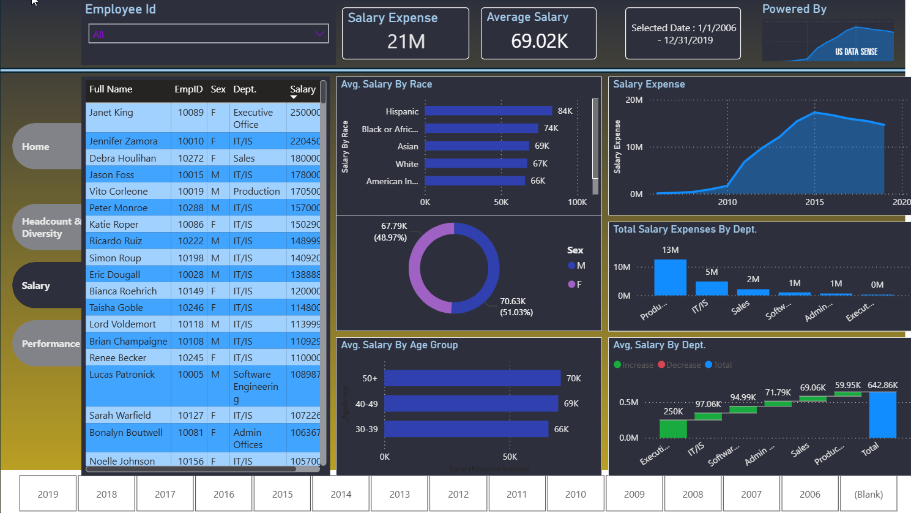
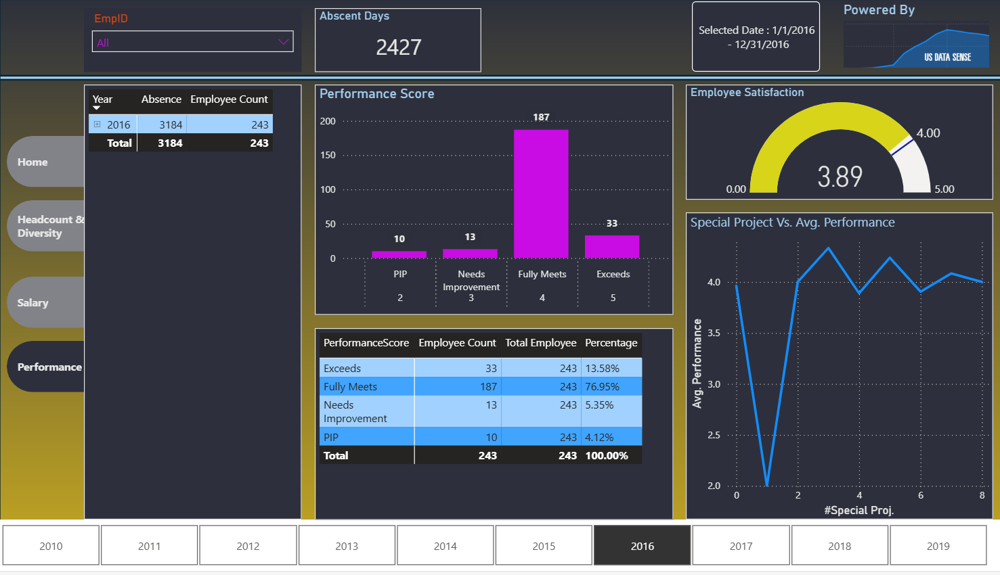

# HR Analytics Dashboard (Power BI)

## 🚀 Live Dashboard (Interactive)

👉 **[Explore the Live Power BI Report](https://app.powerbi.com/view?r=eyJrIjoiZmRkNmU4OGQtNzcxNC00NjgxLWJmZjEtMDQyYmQ2OTJmMjE3IiwidCI6IjQ2MWNiNDRiLWQ4MTEtNGEzYi05OWZmLWM4YTU3N2QzNDI1MiJ9)**

Interact with the dashboard to explore workforce trends, attrition, compensation, and employee performance insights.

---

## Overview

This dashboard provides a comprehensive HR analytics solution covering workforce composition, employee retention, salary distribution, and performance evaluation.

---

## Business Problem

Organizations need visibility into workforce trends, employee retention, and compensation structures to improve productivity, reduce turnover, and support strategic HR decisions.

---

## Key Metrics

- Total Headcount  
- Attrition / Turnover  
- Retention Rate  
- Salary Expense & Distribution  
- Performance Score Distribution  
- Recruitment Sources  

---

## 📸 Dashboard Preview

### 🏠 Home

---

### 👥 Headcount & Diversity

---

### 🔄 Turnover & Retention

---

### 💰 Salary Analysis

---

### 📊 Performance Analysis

---

## 🧠 Key Insights

- Identifies employee turnover patterns and retention trends  
- Highlights workforce distribution across departments and demographics  
- Analyzes compensation structure and salary trends  
- Evaluates employee performance and productivity metrics  
- Supports data-driven HR decision-making  

---

## 🛠️ Tools Used

- Power BI  
- DAX  
- Power Query  
